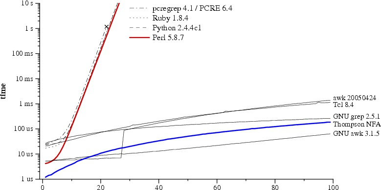
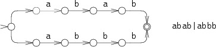
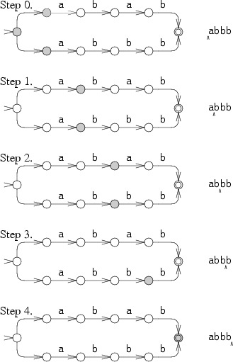

[home](http://tiny.cc/plm18) |
[copyright](https://github.com/txt/plm18/blob/master/LICENSE.md) ©2018, tim@menzies.us
 
 
[syllabus](https://github.com/txt/plm18/blob/master/doc/syllabus.md) |
[src](https://github.com/txt/plm18/tree/master/src) |
[submit](http://tiny.cc/plm18give) |
[chat](https://plm18.slack.com/)

______

# Regular Expressions

This subject is about languages. Some languages are very big (like JAVA) and some are very little.
Regular expressions are  a little language to handle pattern matching.

Regular expressions specifies a sequence of tokens. Tokens are one of:

-   A character
-   The empty string, denoted &epsilon;
-   Two regular expressions next to each other, meaning any string
    generated by the first one followed by (concatenated with) any
    string generated by the second one
-   Two regular expressions separated by a vertical bar (|), meaning any
    string generated by the first one or any string generated by the
    second one
-   A regular expression followed by a star "\*", meaning the
    concatenation of zero or more strings generated by the expression in
    front of the star
-   A regular expression followed by "?" meaning the concatenation of
    zero or one of strings generated by the expression in from of the
    "?"
-   A regular expression followed by "+" meaning the concatenation of
    one or more of strings generated by the expression in from of the
    "+"

Parentheses are used to avoid ambiguity about where the various
sub-expressions start and end.

Consider, for example, the syntax of numeric constants accepted by a
simple hand-held calculator:

      <number>   => <integer> | <real>
      <integer>  => <digit> <digit> *
      <real>     => <integer> <exponent> | <decimal> ( <exponent> | ε )
      <decimal>  => <digit> * ( . <digit> | <digit> . ) <digit> *
      <exponent> => ( e | E ) ( + | - | ε ) <integer>
      <digit>    => 0 | 1 | 2 | 3 | 4 | 5 | 6 | 7 | 8 | 9

Tutorial
--------

### Text Patterns and Matches

A regular expression, or regex for short, is a pattern describing a
certain amount of text. 

This first example is actually a perfectly valid regex. It is the most
basic pattern, simply matching the literal text `regex`. 

We use the term "string" to indicate the text that the regular
expression is applied to. 

### Literal Characters

The most basic regular expression consists of a single literal
character, such as `a`. It matches the first occurrence of that
character in the string. If the string is `Jack is a boy`, it
matches the `a` after the `J`.

This regex can match the second `a` too. It only does so when
you tell the regex engine to start searching through the string after
the first match. In a text editor, you can do so by using its "Find
Next" or "Search Forward" function. In a programming language, there is
usually a separate function that you can call to continue searching
through the string after the previous match.

Twelve characters have special meanings in regular expressions: 

- the
backslash `\`, 
- the caret `^`, 
- the dollar sign
`$`, 
- the period or dot `.`, 
- the vertical bar or pipe
symbol `|`, 
- the question mark `?`, the asterisk or star
`*`, 
- the plus sign `+`, 
- the opening parenthesis
`(`, 
- the closing parenthesis `)`, 
- the opening square
bracket `[`, 
- and the opening curly brace `{`. 

These
special characters are often called "metacharacters".

If you want to use any of these characters as a literal in a regex, you
need to escape them with a backslash. If you want to match
`1+1=2`, the correct regex is `1\+1=2`. Otherwise, the
plus sign has a special meaning.
 
 
### Character Classes or Character Sets

A "character class" matches only one out of several characters. To match
an a or an e, use `[ae]`. You could use this in
`gr[ae]y` to match either `gray` or `grey`. A
character class matches only a single character. `gr[ae]y` does
not match `graay`, `graey` or any such thing. The
order of the characters inside a character class does not matter.

You can use a hyphen inside a character class to specify a range of
characters. `[0-9]` matches a *single* digit between 0 and 9.
You can use more than one range. `[0-9a-fA-F]` matches a single
hexadecimal digit, case insensitively. You can combine ranges and single
characters. `[0-9a-fxA-FX]` matches a hexadecimal digit or the
letter X.

Typing a caret after the opening square bracket negates the character
class. The result is that the character class matches any character that
is *not* in the character class. `q[^x]` matches `qu` in
`question`. It does *not* match `Iraq` since there is
no character after the q for the negated character class to match.
 

### Shorthand Character Classes

`\d` matches a single character that is a digit, `\w`
matches a "word character" (alphanumeric characters plus underscore),
and `\s` matches a whitespace character (includes tabs and line
breaks). The actual characters matched by the shorthands depends on the
software you're using. In modern applications, they include non-English
letters and numbers.
 
### Non-Printable Characters

You can use special character sequences to put non-printable characters
in your regular expression. Use `\t` to match a tab character
(ASCII 0x09), `\r` for carriage return (0x0D) and `\n`
for line feed (0x0A). More exotic non-printables are `\a` (bell,
0x07), `\e` (escape, 0x1B), `\f` (form feed, 0x0C) and
`\v` (vertical tab, 0x0B). Remember that Windows text files use
`\r\n` to terminate lines, while UNIX text files use
`\n`.

If your application supports [Unicode](unicode.html), use
`\uFFFF` or `\x{FFFF}` to insert a Unicode character.
`\u20AC` or `\x{20AC}` matches the euro currency sign.

If your application does not support Unicode, use `\xFF` to
match a specific character by its hexadecimal index in the character
set. `\xA9` matches the copyright symbol in the Latin-1
character set.

All non-printable characters can be used directly in the regular
expression, or as part of a character class.
 

### The Dot Matches (Almost) Any Character

The dot matches a single character, except line break characters. It is
short for `[^\n]` (UNIX applications) or `[^\r\n]`
(Windows applications). Most applications have a "dot matches all" or
"single line" mode that makes the dot match any single character,
including line breaks.

`gr.y` matches `gray`, `grey`, `gr%y`,
etc. Use the dot sparingly. Often, a character class or negated
character class is faster and more precise.
 

### Anchors

Anchors do not match any characters. They match a position. `^`
matches at the start of the string, and `$` matches at the end
of the string. Most regex engines have a "multi-line" mode that makes
`^` match after any line break, and `$` before any line
break. E.g. `^b` matches only the first `b` in
`bob`.

`\b` matches at a word boundary. A word boundary is a position
between a character that can be matched by `\w` and a character
that cannot be matched by `\w`. `\b` also matches at the
start and/or end of the string if the first and/or last characters in
the string are word characters. `\B` matches at every position
where `\b` cannot match.
 

### Alternation

Alternation is the regular expression equivalent of "or".
`cat|dog` matches `cat` in
`About cats and dogs`. If the regex is applied again, it
matches `dog`. You can add as many alternatives as you want:
`cat|dog|mouse|fish`.

Alternation has the lowest precedence of all regex operators.
`cat|dog food` matches `cat` or `dog food`. To
create a regex that matches `cat food` or `dog food`,
you need to group the alternatives: `(cat|dog) food`.
 
### Repetition

The question mark makes the preceding token in the regular expression
optional. `colou?r` matches `colour` or `color`.

The asterisk or star tells the engine to attempt to match the preceding
token zero or more times. The plus tells the engine to attempt to match
the preceding token once or more. `<[A-Za-z][A-Za-z0-9]*>`
matches an HTML tag without any attributes. `<[A-Za-z0-9]+>` is
easier to write but matches invalid tags such as `<1>`.

Finite State Automata
---------------------

A regular expression can be viewed as a finite state automota (FSA) that
recognizes (or generates) a valid sentence in a language.

-   An FSA may be either deterministic (DFSA or DFA) or
    non-deterministic (NFSA or NFA).
-   An FSA is deterministic if its behavior during recognition is fully
    determined by the state it is in and the symbol to be consumed.
    I.e., given an input string, only one path may be taken through the
    FSA.
-   Conversely, an FSA is non-deterministic if, given an input string,
    more than one path may be taken through the FSA. One type of
    non-determinism is e-transitions, i.e. transitions which consume the
    empty string (no symbols).

FSAs can be represented as transitions between states

Parser generators build these state transition tables (so that
subsequent processing a programming language is very fast).

Gawk
----

Regular expression extensions:

-   `^` = start of line;
-   `$` = end of line;
-   `.` = any character;
-   `\x` = escaped character. E.g. ""`\.`" is the period character, not
    any characer.
-   `[abc...]` matches any of the characters abc...
-   `[^abc...]` matches any character except abc... (negated character
    class).
-   `r+` matches one or more r’s.
-   `r?` matches zero or one r’s.
-   `r1|r2` matches either r1 or r2 (alternation).
-   `r1r2` matches r1, and then r2 (concatenation).
-   `(r) matches r (grouping).`

Example 1: trims a string:

      function trim(x) {
          sub(/^[ \t]*/,"",x)
          sub(/[ \t]*$/,"",x)
          return x
       }

Example 2: recognizes an IEEE format number (note that `~` is the match
string operator).

      function numberp(x) {
           return x ~ /^[+-]?([0-9]+[.]?[0-9]*|[.][0-9]+)([eE][+-]?[0-9]+)?$/
       }

### Gawk & Gender Recognition

Scott Pakin. Regular Expressions and Gender Guessing. In Computer
Language Magazine, 8(12):pp. 59-68, December 1991.

      
                                                { sex = "m" }  # Assume male.
      /^.*[aeiy]$/                              { sex = "f" }  # Female names endng in a/e/i/y.
      /^All?[iy]((ss?)|z)on$/                   { sex = "f" }  # Allison (and variations)
      /^.*een$/                                 { sex = "f" }  # Cathleen, Eileen, Maureen,...
      /^[^S].*r[rv]e?y?$/                       { sex = "m" }  # Barry, Larry, Perry,...
      /^[^G].*v[ei]$/                           { sex = "m" }  # Clive, Dave, Steve,...
      /^[^BD].*(b[iy]|y|via)nn?$/               { sex = "f" }  # Carolyn,Gwendolyn,Vivian,...
      /^[^AJKLMNP][^o][^eit]*([glrsw]ey|lie)$/  { sex = "m" }  # Dewey, Stanley, Wesley,...
      /^[^GKSW].*(th|lv)(e[rt])?$/              { sex = "f" }  # Heather, Ruth, Velvet,...
      /^[CGJWZ][^o][^dnt]*y$/                   { sex = "m" }  # Gregory, Jeremy, Zachary,...
      /^.*[Rlr][abo]y$/                         { sex = "m" }  # Leroy, Murray, Roy,...
      /^[AEHJL].*il.*$/                         { sex = "f" }  # Abigail, Jill, Lillian,...
      /^.*[Jj](o|o?[ae]a?n.*)$/                 { sex = "f" }  # Janet, Jennifer, Joan,...
      /^.*[GRguw][ae]y?ne$/                     { sex = "m" }  # Duane, Eugene, Rene,...
      /^[FLM].*ur(.*[^eotuy])?$/                { sex = "f" }  # Fleur, Lauren, Muriel,...
      /^[CLMQTV].*[^dl][in]c.*[ey]$/            { sex = "m" }  # Lance, Quincy, Vince,...
      /^M[aei]r[^tv].*([^cklnos]|([^o]n))$/     { sex = "f" }  # Margaret, Marylou, Miriam,...
      /^.*[ay][dl]e$/                           { sex = "m" }  # Clyde, Kyle, Pascale,...
      /^[^o]*ke$/                               { sex = "m" }  # Blake, Luke, Mike,...
      /^[CKS]h?(ar[^lst]|ry).+$/                { sex = "f" }  # Carol, Karen, Sharon,...
      /^[PR]e?a([^dfju]|qu)*[lm]$/              { sex = "f" }  # Pam, Pearl, Rachel,...
      /^.*[Aa]nn.*$/                            { sex = "f" }  # Annacarol, Leann, Ruthann,...
      /^.*[^cio]ag?h$/                          { sex = "f" }  # Deborah, Leah, Sarah,...
      /^[^EK].*[grsz]h?an(ces)?$/               { sex = "f" }  # Frances, Megan, Susan,...
      /^[^P]*([Hh]e|[Ee][lt])[^s]*[ey].*[^t]$/  { sex = "f" }  # Ethel, Helen, Gretchen,...
      /^[^EL].*o(rg?|sh?)?(e|ua)$/              { sex = "m" }  # George, Joshua, Theodore,..
      /^[DP][eo]?[lr].*se$/                     { sex = "f" }  # Delores, Doris, Precious,...
      /^[^JPSWZ].*[denor]n.*y$/                 { sex = "m" }  # Anthony, Henry, Rodney,...
      /^K[^v]*i.*[mns]$/                        { sex = "f" }  # Karin, Kim, Kristin,...
      /^Br[aou][cd].*[ey]$/                     { sex = "m" }  # Bradley, Brady, Bruce,...
      /^[ACGK].*[deinx][^aor]s$/                { sex = "f" }  # Agnes, Alexis, Glynis,...
      /^[ILW][aeg][^ir]*e$/                     { sex = "m" }  # Ignace, Lee, Wallace,...
      /^[^AGW][iu][gl].*[drt]$/                 { sex = "f" }  # Juliet, Mildred, Millicent,...
      /^[ABEIUY][euz]?[blr][aeiy]$/             { sex = "m" }  # Ari, Bela, Ira,...
      /^[EGILP][^eu]*i[ds]$/                    { sex = "f" }  # Iris, Lois, Phyllis,...
      /^[ART][^r]*[dhn]e?y$/                    { sex = "m" }  # Randy, Timothy, Tony,...
      /^[BHL].*i.*[rtxz]$/                      { sex = "f" }  # Beatriz, Bridget, Harriet,...
      /^.*oi?[mn]e$/                            { sex = "m" }  # Antoine, Jerome, Tyrone,...
      /^D.*[mnw].*[iy]$/                        { sex = "m" }  # Danny, Demetri, Dondi,...
      /^[^BG](e[rst]|ha)[^il]*e$/               { sex = "m" }  # Pete, Serge, Shane,...
      /^[ADFGIM][^r]*([bg]e[lr]|il|wn)$/        { sex = "f" }  # Angel, Gail, Isabel,...
                                                { print sex }  # Output prediction

### Gawk & Domain-Specific Language

Input langauge

      label here's some stuff
      bottom ticks 1 5 10 
      left ticks 1 2 10 20
      range 1 1 10 22
      height 10
      width 30
      1 2 *
      2 4 * 
      3 6 *
      4 8 *
      7 14 +
      8 12 +
      9 10 +
      mb 0.9 11 =

Output example:

            |----------------------|
      20    -                 = =  =
            |       = =  = =       |
            =  = =         +  +    |
      10    -                   +  |
            |    *  *              |
            |  *                   |
      2     *---------|------------|
           1         5            10
               here's some stuff    

The code is [here](https://github.com/timm/lawker/blob/master/fridge/gawk/misc/graph.awk).
 Note the use of guard
action pairs, where the guards are regular expressions.

Fast and Slow Regular Expression Processing
-------------------------------------------

(From a page by [Russ Cox](http://swtch.com/~rsc/regexp/regexp1.html).)

Strange to say, many modern languages use a simplistic recursive descent
test for regular expressions.

-   Dumb way (Ruby, Python, Perl): if one pattern fails, then the
    processor goes all the way back to the start of the pattern.
-   Smarter way (Awk): parallel traversal of all pathways

e.g. Lets build two finate state automoa for the patterhn `abab|abbb`
and run it the string `abbb`.

First, the dumb way:

A more efficient but more complicated way to simulate perfect guessing
is to guess both options simultaneously. In this approach, the
simulation allows the machine to be in multiple states at once. To
process each letter, it advances all the states along all the arrows
that match the letter.

Note that this second way was first implemented by Ken Thompson
introduced the multiple-state simulation approach in his 1968 paper. The
[full source code](http://swtch.com/~rsc/regexp/) (under 400 lines) and
the benchmarking scripts are available online

Thompson introduced his regualr expression to programmers in his
implementation of the text editor QED for CTSS. Dennis Ritchie followed
suit in his own implementation of QED, for GE-TSS. Thompson and Ritchie
would go on to create Unix, and they brought regular expressions with
them. By the late 1970s, regular expressions were a key feature of the
Unix landscape, in tools such as ed, sed, grep, egrep, awk, and lex.

By the way, for a good time, read and marvel at the technial brevity and preciseness
of [Thompson's 1968 paper](https://www.fing.edu.uy/inco/cursos/intropln/material/p419-thompson.pdf).

Tokenizers
----------

LEX is a C-based tool for building compilers. It is a pre-processing
step that uses regualr expressions to (say), skip white space, and
assign some simple tags to each remaining inout token.

Generic approach to recongizing parts of an input stream, then
performing specific actions for certain sections. (Historical note: LEX
came first, then Gawk).

Guard action pairs. Guards defined by regular expressions:

-   `x*` = zero or more
-   `x+` = one or more
-   `[abc]` = "or". Anyone of "a" or "b" or "c"
-   `\n` = new line
-   `\t` = new line

Code:

      %{
      #include <stdlib.h>
      #include "calc3.h"
      #include "y.tab.h"
      void yyerror(char *);
      %}
      
      %%
      
      [a-z]       { 
                      yylval.sIndex = *yytext - 'a';
                      return VARIABLE;
                  }
      
      0           {
                      yylval.iValue = atoi(yytext);
                      return INTEGER;
                  }
      
      [1-9][0-9]* {
                      yylval.iValue = atoi(yytext);
                      return INTEGER;
                  }
      
      [-()<>=+*/;{}.] {
                      return *yytext;
                   }
      
      ">="            return GE;
      "<="            return LE;
      "=="            return EQ;
      "!="            return NE;
      "while"         return WHILE;
      "if"            return IF;
      "else"          return ELSE;
      "print"         return PRINT;
      
      [ \t\n]+        ;       /* ignore whitespace */
      
      .               yyerror("Unknown character");
      %%
      int yywrap(void) {
          return 1;
      }

A Simple RE Parser
------------------

(Note: not examinable.)

From *A Regular Expression Matcher* by Brian Kernighan (in *Beautiful
Code*, O'Reily Books).

Here's the world's smallest RE parser for the world's smallest RE
language.

-   c (any characters) Matches any literal character c.
-   . (period) Matches any single character.
-   \^ Matches the beginning of the input string.
-   \$ Matches the end of the input string.
-   \* Matches zero or more occurrences of the previous character.

This is quite a useful class; in my own experience of using regular
expressions on a day-to-day basis, it easily accounts for 95 percent of
all instances.

      /* match: search for regexp anywhere in text */
          int match(char *regexp, char *text)
          {
              if (regexp[0] == '^')
                  return matchhere(regexp+1, text);
              do {    /* must look even if string is empty */
                  if (matchhere(regexp, text))
                      return 1;
              } while (*text++ != '\0');
              return 0;
          }
      
          /* matchhere: search for regexp at beginning of text */
          int matchhere(char *regexp, char *text)
          {
             if (regexp[0] == '\0')
                 return 1;
             if (regexp[1] == '*')
                 return matchstar(regexp[0], regexp+2, text);
      
             if (regexp[0] == '$' && regexp[1] == '\0')
                 return *text == '\0';
             if (*text!='\0' && (regexp[0]=='.' || regexp[0]==*text))
                 returnmatchhere(regexp+1, text+1);
             return 0;
          }
      
          /* matchstar: search for c*regexp at beginning of text */
          int matchstar(int c, char *regexp, char *text)
          {
             do {   /* a * matches zero or more instances */
                 if (matchhere(regexp, text))
                     return 1;
             } while (*text != '\0' && (*text++ == c || c == '.'));
             return 0;
          }

The function match(regexp, text) tests whether there is an occurrence of
the regular expression anywhere within the text; it returns 1 if a match
is found and 0 if not. If there is more than one match, it finds the
leftmost and shortest.

The basic operation of `match` is straightforward. If the first
character of the regular expression is `^` (an anchored match), any
possible match must occur at the beginning of the string. That is, if
the regular expression is `^xyz`, it matches `xyz` only if `xyz` occurs
at the beginning of the text, not somewhere in the middle. This is
tested by matching the rest of the regular expression against the text
starting at the beginning and nowhere else. Otherwise, the regular
expression might match anywhere within the string. This is tested by
matching the pattern against each character position of the text in
turn. If there are multiple matches, only the first (leftmost) one will
be identified. That is, if the regular expression is `xyz`, it will
match the first occurrence of `xyz` regardless of where it occurs.

Notice that advancing over the input string is done with a `do-while`
loop, a comparatively unusual construct in C programs. The occurrence of
a `do-while` instead of a `while` should always raise a question: why
isn't the loop termination condition being tested at the beginning of
the loop, before it's too late, rather than at the end after something
has been done? But the test is correct here: since the \* operator
permits zero-length matches, we first have to check whether a null match
is possible.

The bulk of the work is done in the function `matchhere(regexp, text)`,
which tests whether the regular expression matches the text that begins
right here. The function `matchhere` operates by attempting to match the
first character of the regular expression with the first character of
the text. If the match fails, there can be no match at this text
position and `matchhere` returns 0. If the match succeeds, however, it's
possible to advance to the next character of the regular expression and
the next character of the text. This is done by calling `matchhere`
recursively.

The situation is a bit more complicated because of some special cases,
and of course the need to stop the recursion. The easiest case is that
if the regular expression is at its end (`regexp[0]=='\0'`), all
previous tests have succeeded, and thus the regular expression matches
the text.

If the regular expression is a character followed by a `*, matchstar` is
called to see whether the closure matches. The function
`matchstar(c, regexp, text)` tries to match repetitions of the text
character `c`, beginning with zero repetitions and counting up, until it
either finds a match of the rest of the text, or it fails and thus
concludes that there is no match. This algorithm identifies a "shortest
match," which is fine for simple pattern matching as in grep, where all
that matters is finding a match as quickly as possible. A "longest
match" is more intuitive and almost certain to be better for a text
editor where the matched text will be replaced. Most modern regular
expression libraries provide both alternatives, and The Practice of
Programming presents a simple variant of matchstar for this case, shown
below.

If the regular expression consists of a \$ at the end of the expression,
the text matches only if it too is at its end:

      if (regexp[0] == '$' && regexp[1] == '\0') return *text == '\0';

Otherwise, if we are not at the end of the text string (that is,
`*text!='\0'`), and if the first character of the text string matches
the first character of the regular expression, so far so good; we go on
to test whether the next character of the regular expression matches the
next character of the text by making a recursive call to `matchhere`.
This recursive call is the heart of the algorithm and the reason why the
code is so compact and clean.

If all of these attempts to match fail, there can be no match at this
point between the regular expression and the text, so `matchhere`
returns 0.

This code uses C pointers intensively. At each stage of the recursion,
if something matches, the recursive call that follows uses pointer
arithmetic (e.g., `regexp+1` and `text+1`) so that the subsequent
function is called with the next character of the regular expression and
of the text. The depth of recursion is no more than the length of the
pattern, which in normal use is quite short, so there is no danger of
running out of space.

## Pattern Matching Over Very Big Spaces

Gerald Holzman's COBRA system:

- Talk starts at 30:31 in [this YouTube presentation](https://www.youtube.com/watch?v=mVkz-ETpb0w)
- And don't listen to the guy at 1:32:30 

39,144 files in 18,633,817 lines of code (LINUX 4.3)

16 cores

10 seconds to load code

0.6 seconds, even for complex queries.

