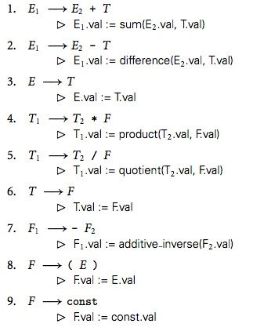
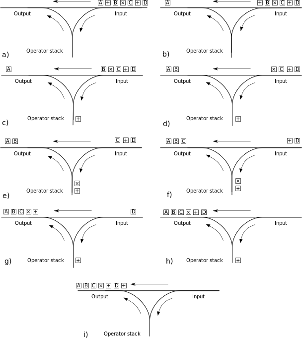

[home](http://tiny.cc/plm18) |
[copyright](https://github.com/txt/plm18/blob/master/LICENSE.md) &copy;2018, tim&commat;menzies.us
<br>
[](http://tiny.cc/plm18)<br>
[syllabus](https://github.com/txt/plm18/blob/master/doc/syllabus.md) |
[src](https://github.com/txt/plm18/tree/master/src) |
[submit](http://tiny.cc/plm18give) |
[chat](https://plm18.slack.com/)


______


# Syntactic Analysis


Standard approach

1. The lexical phase (scanner) groups characters into lexical units or
  tokens. The input to the lexical phase is a character stream. The
  output is a stream of tokens. Regular expressions are used to define
  the tokens recognized by a scanner (or lexical analyzer). The
  scanner is implemented as a finite state machine.
2. The parser groups tokens into syntactical units. The output of the
  parser is a parse tree representation of the program.  Context-free
  grammars are used to define the program structure recognized by a
  parser. The parser is implemented as a push-down automata.
3. The contextual analysis phase analyzes the parse tree for
  context-sensitive information often called the static semantics. The
  output of the contextual analysis phase is an annotated parse
  tree. Attribute grammars are used to describe the static semantics
  of a program.
4. The optimizer applies semantics preserving transformation to the
  annotated parse tree to simplify the structure of the tree and to
  facilitate the generation of more efficient code.
5. The code generator transforms the simplified annotated parse tree
  into object code using rules which denote the semantics of the
  source language.
6. The peep-hole optimizer examines the object code, a few instructions
  at a time, and attempts to do machine dependent code improvements.## Commit to some Semantics

Standard pipeline

    tokenization ==> lexical analysis ==> parsing ==> (a) ==> code generation ==> (b)

Note that before code generation they may also be

    (a) = context anaysis ==> optimizer 

And after code generation 

    (b) = peephole optimization

This talk: 

- Syntax: everything up to and including parsing

Next talk:

- Semantics: the rest.


## Tokenization (fast, easy)

Group input stream (of characters) into a stream of
tokens (lexeme) and constructs a symbol table which is used later for
contextual analysis. The lexemes include

+ Kill whitespace, comments, etc ...
+ Key words,
+ identifiers,
+ operators,
+ constants: numeric, character, special, and Witem comments.

Returns an array of tokens.

### Small example (cheating, a little)

This one is a hack. A beautiful hack. But a hack never the less.

_From http://norvig.com/lispy.html_

Running:

    >> program = "(begin (define r 10) (* pi (* r r)))"
    
    >>> parse(program)
    ['begin', ['define', 'r', 10], ['*', 'pi', ['*', 'r', 'r']]]

Code:    

```python
Symbol = str          # A Lisp Symbol is implemented as a Python str
List   = list         # A Lisp List is implemented as a Python list
Number = (int, float) # A Lisp Number is implemented as a Python int or float


def parse(program):
    "Read a Scheme expression from a string."
    return read_from_tokens(tokenize(program))

def tokenize(s):
    "Severely cheating. Convert a string into a list of tokens."
    return s.replace('(',' ( ').replace(')',' ) ').split()

def read_from_tokens(tokens):
    "Read an expression from a sequence of tokens."
    if len(tokens) == 0:
        raise SyntaxError('unexpected EOF while reading')
    token = tokens.pop(0)
    if '(' == token:
        L = []
        while tokens[0] != ')':
            L.append(read_from_tokens(tokens))
        tokens.pop(0) # pop off ')'
        return L
    elif ')' == token:
        raise SyntaxError('unexpected )')
    else:
        return atom(token)

def atom(token):
    "Numbers become numbers; every other token is a symbol."
    try: return int(token)
    except ValueError:
        try: return float(token)
        except ValueError:
            return Symbol(token)
```

### Large Example

Using a more scalable, less hacky tool (Flex).


INPUT:


      abc123z.!&*2ghj6


ANALYZER (in Flex)


        /*** Definition section ***/
        
        %{
        /* C code to be copied verbatim */
        #include <stdio.h>
        %}
        
        /* This tells flex to read only one input file */
        %option noyywrap
        
        %%
            /*** Rules section ***/
        
            /* [0-9]+ matches a string of one or more digits */
        [0-9]+  {
                    /* yytext is a string containing the matched text. */
                    printf("Saw an integer: %s\n", yytext);
                }
        
        .       {   /* Ignore all other characters. */   }
        
        %%
        /*** C Code section ***/
        
        int main(void)
        {
            /* Call the lexer, then quit. */
            yylex();
            return 0;
        }


OUTPUT:

       Saw an integer: 123
       Saw an integer: 2
       Saw an integer: 6

### Even  larger example 

[coco](http://satyr.github.io/coco/src/#lexer19)

## Lexical (fast, easy)

Lexical analysis: what kinds of words are in there?

- e.g. are you an operator (e.g. plus, minus, multiple) or an operand (1,2,"tim")
- e.g. if operand are you a number or a string or boolean or...?
- e.g. if operator are you a built-in (e.g. "while") or an extension (e.g. a method you've defined)
- e.g. if operator is it unary (1 argument), binary (2 args), n-ary (n args)
- e.g. if a "while" are you while, repeat-until, etc

Returns the token array, augmented with some extra information.

### Small example:

```prolog
sentence(s(NP,VP))               --> noun_phrase(NP,Num), verb_phrase(VP,Num).

noun_phrase(np(DET, NP2), Num)   --> determiner(DET, Num), noun_phrase2(NP2, Num).
noun_phrase(np(NP2), Num)        --> noun_phrase2(NP2, Num).
noun_phrase2(np2(N), Num)        --> noun(N, Num).
noun_phrase2(np2(ADJ, NP2), Num) --> adjective(ADJ), noun_phrase2(NP2, Num).

verb_phrase(vp(V), Num)          --> verb(V, Num).  
verb_phrase(vp(V, NP), Num)      --> verb(V, Num), noun_phrase(NP, _).

determiner(det(the), _)      --> [the].
determiner(det(a), singular) --> [a].

noun(n(pumpkin), singular)   --> [pumpkin].
noun(n(pumpkins), plural)    --> [pumpkins].
noun(n(lecturer), singular)  --> [lecturer].
noun(n(lecturers), plural)   --> [lecturers].

adjective(adj(possessed))    --> [possessed].

verb(v(scares), singular)    --> [scares].
verb(v(scare), plural)       --> [scare].
```
Example:

     [the,pumpkin,scares,the,lecturer] ==>
     s(np(det(the),np2(n(pumpkin))),vp(v(scares),np(det(the),np2(n(lecturer)))))

### Larger example: [coco](http://satyr.github.io/coco/src/#lexer)

- Questions:
   - What are the two kinds of "\\HURL"s in Coco?
   - Coco treats "\\unless" and "\\until" as synonyms for  something else. What?


## Parsing (not-so-fast, not-so-easy)

Here, you actually have to commit to what is, and is not, acceptable in your language.

Welcome to the wonderful world of grammaers.

Parsing = convert a sequence of linear tokens into a tree.

Grammer = space of all possible trees allowed by a language

One program = one tree from that grammer.

A parser groups tokens into syntactical units. The output of the
parser is a parse tree representation of the program.
Grammars are used to define the program structure recognized by a
parser. 


Definitions

-   A "sentence" is a string of characters over some alphabet
-   A "language" is a set of sentences
-   A "lexeme" is the lowest level syntactic unit of a language (e.g.,
    \*, sum, begin)
-   A "token" is a category of lexemes (e.g., identifier)

Context-Free Grammars

-   Developed by Noam Chomsky in the mid-1950s
-   Language generators, meant to describe the syntax of natural
    languages Define a class of languages called context-free languages

Backus-Naur Form (1959)

-   Invented by John Backus to describe Algol 58
-   BNF is equivalent to context-free grammars

Example:

      <program> ==> <stmts>
        <stmts> ==> <stmt> | <stmt> ; <stmts>
         <stmt> ==> <var> = <expr>
         <var>  ==> a | b | c | d
         <expr> ==> <term> + <term> | <term> - <term>
         <term> ==> <var> | const

Example derivation:

      <program> => <stmts>  => <stmt> 
                            => <var> = <expr> 
                            => a = <expr> 
                            => a = <term> + <term>
                            => a = <var> + <term> 
                            => a = b + <term>
                            => a = b + cons

Or, consider, for example, the syntax of numeric constants accepted by a
simple hand-held calculator:

      <number>   => <integer> | <real>
      <integer>  => <digit> <digit> *
      <real>     => <integer> <exponent> | <decimal> ( <exponent> | ε )
      <decimal>  => <digit> * ( . <digit> | <digit> . ) <digit> *
      <exponent> => ( e | E ) ( + | - | ε ) <integer>
      <digit>    => 0 | 1 | 2 | 3 | 4 | 5 | 6 | 7 | 8 | 9

### Parse tree

A hierarchical representation of a derivation

                    <program>
                        |
                     <stmts>
                        |
                     <stmt>
                    /  |   \
                   /   |    \
                  /    |     \
              <var>   "="    <expr>
                |           /  |   \
              "a"     <term>  "+"   <term>
                        |             |
                      <var>         const
                        |
                       "b"

A grammar is "ambiguous" if and only if it generates a sentential form
that has two or more distinct parse trees

Example:

       <expr> ==> <expr> <op> <expr>  |  const
       <op>   ==> /  |  -

Two possible outputs:

                         <expr>                      <expr>
                        /   \   \                   /   |    \
                       /     \   \                 /    |     \
                <expr>     <op>  <expr>        <expr>  <op>   <expr>
                /  |   \       \      |          |      |    |  \   \
               /   |    \       |     |          |      |    |   \    \
              /    |     \      |     |          |      |    |    \     \
          <expr> <op>  <expr>   |     |          |      |   <expr> <op> <expr>
            |      |     |      |     |          |      |      |     |     |
          const   "-"   const   "/"  const     const   "-"   const  "/"   const

Fix: If we use the parse tree to indicate precedence levels of the
operators, we cannot have ambiguity

Example:

          <expr> ==> <expr> - <term>  |  <term>
          <term> ==> <term> / const| const

Output:

             <expr>
            /   |   \
       <expr>  "-"  <term>
          |         |  \  \
          |         |   \  \
          |         |    \  \
       <term>    <term> "/"  const
          |         |
       <const>   <const>


Operator associativity can also be indicated by a grammar


       <expr> ==> <expr> + <expr> |  const  (ambiguous)
       <expr> ==> <expr> + const  |  const  (unambiguous


Parse:

                                   <expr>
                                  /  |   \
                            <expr>  "+"   const
                          /   |   \    
                    <expr>   "+"   const 
                       |
                     const

Attributed Grammars
-------------------

Grammars generate all properly formed expressions in some language but
says nothing about their meaning. To tie these expressions to
mathematical concepts we need additional notation.

The most common is based on attributes. In our expression grammar, we
can associate a val attribute with each E, T, F, and const in the
grammar.

The intent is that for any symbol S, S.val will be the meaning, as an
arithmetic value, of the token string derived from S. We assume that the
val of a const is provided to us by the scanner.

We must then invent a set of rules for each production, to specify how
the vals of different symbols are related. The resulting *attribute
grammar* (AG) for a simple calculator is shown here:
 


Yacc and Bison are tools for generating parsers in C. Bison
is a faster version of Yacc. Jack is a tool for generating scanners
and top-down parsers in Java.

### Precedence-driven Parsing

Fast, good for simple languages via the shunting yard algorithm.

Background: reverse Polish notation

- Operands appear before operators
- Not 3 + 4
    - But 3 4 +
- Not 3 − 4 + 5
    - But 3 4 − 5 +

Crazy simple to execute

1. Input is a list we process left to right
2. Internally, we keep a stack for temp results
3. Pop next left-most item from input
4. If operand, push to temp stack
5. If binary operator, pop next two items from temp stack, combine, push result to stack
6. If  input empty, return first item in temp stack

```python
import sys
def hi(x):
  sys.stdout.write(x)

def rpn(input):
  minus    = lambda x,y : x - y
  plus     = lambda x,y : x + y
  mult     = lambda x,y : x * y
  args     = {"+" : plus, 
              "*" : mult, 
              "-" : minus}
  operator = lambda x: x in args
  stack    = []
  print('input = ', input)
  print('stack = ', stack)
  while input:
    token = input.pop(0)
    if not operator(token): # if operator, push token to stack
      stack += [token]
    else:
      two = stack.pop()     # if operator, pop next two stack items
      one = stack.pop()
      f= args[token]        # do something with them
      stack += [f(one,two)] # push to stack
    print('\ntoken = ',token)
    print('input = ', input)
    print('stack = ', stack)
  return stack[0]           # return first item in stack

def _rpn():
  print("5 + ((1 + 2) * 4) - 3 = " )
  print(rpn([5,1,2,"+",4,"*","+",3,"-"]))

_rpn()
```

Example:

```
$ python3 rpn.py
5 + ((1 + 2) * 4) - 3 =
input =  [5, 1, 2, '+', 4, '*', '+', 3, '-']
stack =  []

token =  5
input =  [1, 2, '+', 4, '*', '+', 3, '-']
stack =  [5]

token =  1
input =  [2, '+', 4, '*', '+', 3, '-']
stack =  [5, 1]

token =  2
input =  ['+', 4, '*', '+', 3, '-']
stack =  [5, 1, 2]

token =  +
input =  [4, '*', '+', 3, '-']
stack =  [5, 3]

token =  4
input =  ['*', '+', 3, '-']
stack =  [5, 3, 4]

token =  *
input =  ['+', 3, '-']
stack =  [5, 12]

token =  +
input =  [3, '-']
stack =  [17]

token =  3
input =  ['-']
stack =  [17, 3]

token =  -
input =  []
stack =  [14]
14
```

## Associativity

Associativity tells us about how to chain together operators (i.e. in
which direction we should build the tree).

In Prolog, the following
operators of the same precedence can be next to each other and
their place in the parse tree is determined by the _associativity_


+  _xfy_ is infix right associative
+  _fy_  is prefix right associative
+  _yfx_ is infix left associative.

Code:

     :- op( 1200, xfx, [ :-, --> ]).
     :- op( 1000, xfy, [ ',' ]).
     :- op(  500, yfx, [ +, -]).
     :- op(  500,  fx, [ +, - ]).


Example: "a :- b,c". In the following, the operators are ":-" and ","


    a :- b,c


This parses as follows (with ":-" higher than "," since it binds later):

            :-
            |
      -------------
      |           |
      a           ,
                  |
              ----------
              |        |
              b        c
			  
Example:    "- 3 - 5 + 6 + 10"


                          +
                          |
            ---------------------------						  
            |                         |						 
            +                        10
            |
      -------------
      |           |
      -           6
      |
    ----------
    |        |
    -        5
    |
    3 

Note that:

+ Note that "+" being left associative allows "+" to be a parent of "+"
  (top row).
+ This uses _two_ different "-": an infix "-" and a prefix "-".
+ The tree is biased to the left since the infix maths operators are "yfx",
  i.e. they are _left_ associative.
     + This means that a left to right top-down execution  
	   would process the expression left to right
	      + As we might expect.

## Shunting Yard Algorithm

Edsger Dijkstra, 1961. How to convert infix to RPN.

+ BTW, generalizes to [operator-precedence 
  parsing](http://en.wikipedia.org/wiki/Operator-precedence_parser).

We'll study a simplified version
that ignores brackets or function symbols or brackets or associativity.

The algorithm _shunts_ tokens between three lists:

+ A _stack_ of operators (this is a freezer that stores operators we do not yet know how to handle);
+ An _output_ list in RPN
+ _Input_ tokens: e.g. "A+B*C+D"  
    + converted to the list ["A","+","D","\*","C","+","D"]

Recall from the above, we want to read "A+B*C+D" as the tree.
Note that the following tree assumes  "+" has a higher precedence to "*".


            +
            |
    -----------------
    |               |
    A               +
                    |
	        ------------------
            |                |
	        *                D
            |
        ---------
        |       |
        B       C


From that, we want the RPN list:

    A
    B
    C
    *
    D   
    +   
    +

### Rules of Shunting

Rule #1-  non-ops go straight to _output_:

+ if the next _input_ token has zero precedence, move it straight to _output_.

Rule #3- ops go to the operator _stack_:

+ if the next _input_ token is an operator, move it to the operator _stack_.

Rule #2 (fires before Rule3)- sometimes, purge operator _stack_:

+ If the next _input_ token is an operator with lower precedence that the
  top of the operator _stack_
      + Then we need to do the operators on the _stack_ *before* the next token
+ So we need to pop the operator _stack_ and push that content to the _output_:
          
Rule #4- finale:

+ If tokens are done, and there is anything left in the operator _stack_
    + pop them to _output_.

### Example




### Code

Infix to RPN:

    class Op:
      all = []
      def __init__(i,name,precedence=100):
        i.name=name
        i.precedence = precedence
        Op.all += [i]
      def __repr__(i):
        return i.name + '{' + str(i.precedence) + '}'
     
Parsing utils:

    def isa(x):
      "Try to find the operator names 'x'. Else fail."
      for y in Op.all:
        if x == y.name: return y
      return None
        
    def isNum(x):
      "Let Python do the heavy lifting"
      try: return int(x)
      except ValueError:
        try: return float(x)
        except ValueError:
          return None
    
Main engine:

    import re
    class Shunt:
      """ Simple version of Edsger Dijkstra's shunting yard algorithm.
          No associativity, brackets, function symbols, arguments.
          No error checking.
          For full version, see http://goo.gl/pakbVu
      """
      def __init__(i,str):
        say(str + ' : ')
        i.out   = []
        i.stack = []
        for token in i.tokens(str): 
          i.shunt(token)
        # tidy up
        while i.stack: i.up()
      def __repr__(i)   : return str(i.out)
      def over(i,token) : say("o"); i.out   += token
      def down(i,op)    : say("d"); i.stack += [op]
      def up(i)         : say("u"); i.out   += [i.stack.pop()] 
      def somethingIsMoreImportant(i,op):
        return i.stack and op.precedence <= i.stack[-1].precedence
      def tokens(i,str): 
        "dumb tokenizer: assumes tokens one char wide)"
        return list(re.sub("[ \t]*","",str)) 
      def shunt(i,token):
        op = isa(token)
        if not op:
          i.over(token)
        else:
          while i.somethingIsMoreImportant(op):
            i.up()
          i.down(op)

Demos:

    @go
    def _shunt():
      Op.all = []
      Op('+',1)
      Op('*',2)
      Op('/',2)
	  print Shunt("1 + 2")         # 1 2 +
	  print Shunt("1 + 2 + 3")     # 1 2 + 3 +
      print Shunt("1 + 2 / 3")     # 1 2 3 / +
      print Shunt("a * b + c / d") # a b * c d / +
      print Shunt("a * b + c * d") # a b * c d * +
 
Note: the above is a _simple_ shunt. A _full_ shunt handles 
brackets, functions with arguments, etc. 

+ For full algorithm see [here](http://en.wikipedia.org/wiki/Shunting-yard_algorithm#The_algorithm_in_detail).
+ For a  full implementation  (in Python and Java), see
  [here](http://andreinc.net/2010/10/05/converting-infix-to-rpn-shunting-yard-algorithm).  Handles nested brackets,etc.


## Aside: Prolog

Tokenization, lexical analsis, attributed-grammers,
precendence-driven parsing, all pretty much for free

Example:
Lets carry around numbers that we compute representing,
say, our belief in the current conclusions. In fuzzy logic we believe
conjunctions at the _minimum_ belief of each part and we believe
disjunctions at the _maximum_ belief of each part (and for negation,
we take the _complement_). For example here is a full Prolog version
of a fuzzy logic interpreter. Like DCGs, this is still a set of clauses
but now we are free to do more in each clause. Prolog denotes DCGs with a
_-->_ neck an full Prolog with a _:-_ neck.
        
    :- op(999,xfx,if).
    :- op(998,xfy,or).
    :- op(997,xfy,and).
    :- op(997,fy,not).
    
    student if young and poor and not not not dumb.
    % if( student, 
    %    and( young,
    %          and( poor
    %               not( 
    %                 not( 
    %                  not( dumb ))))))
                
    
    dumb if not smart.
    % if( dumb,
    %      not( smart ))
    
    cf(young,0.4).
    cf(poor,0.9).
    cf(smart,0.9).
    
    belief(X,Y) :- cf(X,Y).
    belief(X,Cf) :-
    	X if Z,
    	belief(Z,Cf).
    
    belief(and(X,Y),CF0) :-
    	belief(X,CF1),
    	belief(Y,CF2),
    	CF0 is min(CF1,CF2).
    
    belief(or(X,Y),CF0) :-
    	belief(X,CF1),
    	belief(Y,CF2),
    	CF0 is max(CF1,CF2).
    
    belief(not(X),CF0) :-
    	belief(X,CF1),
    	CF0 is 1 - CF1.


## Object Grammars

Going one step further, the "Parse tree" is a nested set of objects. In
this design, each non-terminal is some instance of sub-class of
"Grammar". Once a language is parsed, an OO interpreter can execute the
parse tree, with each non-terminal handling the specific processing
associated with that node.

For example, an if-test would create and instance of class "If" with
slots for "expr" and then "then" and "else" actions.

      <if> => if <expr> then <action> else <action> fi

To interpret this, the OO interpreter just sends the message "evaluate"
to this instance which, in turn, sends "evaluate" to "expr". If that
returns true, then the "then" action is messaged with "evaluate". Else,
we "evaluate" the "else".

### OCAML

Pure function language. Functions define a relationship between input
types and output types.

A strongly typed language (at compile time, you know if a variable is a
string, number, whatever) and supported type inferencing (so you can
check if you are doing dumb things like adding a number to a string).

OCaml supports recursive type definitions. Question: is the following a
type system or a grammar or both?

      type paragraph =
          Normal of par_text
        | Pre of string * string option
        | Heading of int * par_text
        | Quote of paragraph list
        | Ulist of paragraph list * paragraph list list
        | Olist of paragraph list * paragraph list list
      
      and par_text = text list
      
      and text =
          Text of string
        | Emph of string
        | Bold of string
        | Struck of par_text
        | Code of string
        | Link of href
        | Anchor of string
        | Image of img_ref
      
      and href = { href_target : string; href_desc : string; }
      
      and img_ref = { img_src : string; img_alt : string; }

The Ulist and Olist constructors take the first item followed by a
(possible empty) list of items, to prevent empty lists --- this way,
there's at least one element.

So
[eigenclass.org](http://eigenclass.org/R2/writings/fast-extensible-simplified-markdown-in-ocaml)
uses the above to define a cool generator for HTML pages using a set of
short-cuts:

-   any character can be escaped with \\,
-   emphasis is done with \_\_ (less prone to accidental use than \_)
    and bold text with \*,
-   typographical abuses like bold emphasized text are not allowed,
-   headers are done with !level1 header, !!level2 header, etc.,
-   the \# character is thus free and can be used for numbered lists,
    replacing 1.,
-   pre-formatted code is done with


       {{
         whatever
       }}

It is possible to extend the markup with custom processors, using
    `{{extension-name` blocks; for instance, raw HTML is inserted with

    {{html
      <b> whatever </b>
    }}

(before you try to inject arbitrary HTML in the comments: this
    extension is only enabled in the main text).

The above grammar is the core of a parser that generates HTML. And,
interestingly, in this ultra-high level language, this parse runs very
very fast. <font size="2">

                                            runtimes                       memory
                                            -----------------------------  -------------
                                LoCs        README.1  README.8  README.32  README.32 MEM
      discount         C        ~4500                 0.016s    0.063s     2.8MB
      Bluecloth        Ruby     1100        0.130s    2.16s     30s        31MB
      markdown         Perl     1400        0.068s    0.66s     segfault   segfault
      python-markdown  Python   1900        0.090s    0.35s     2.06s      23MB
      Pandoc           Haskell   900 + 450  0.068s    0.55s     2.7s       25MB
      ----------------------------------------------------------------------------------
      Simple_markup    OCaml    313 + 55              0.012s    0.043s     3.5MB

</font>
So, in the 21st century, you can have you cake and eat it too:

-   High-level descriptions.
-   Tiny code.
-   Fast runtimes.

Excellent example of how pure theory improves implementations.

